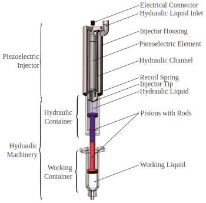
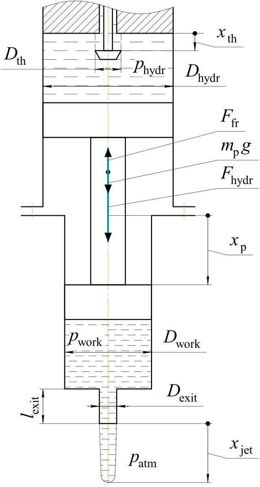

# Model Predictive Control of the Droplet Generation System

## Overview

The **goal** of this project is to create an optimal control of the droplet generator system (it's hydraulic part) by Model Predictive Control.

- Course: Advanced Control Methods, Skoltech, 2024
- Team Members: [Mikhail Vulf](https://github.com/mvulf/), [Aleksandr Kolomeitcev](https://github.com/Alexander19970212)
- Final Presentation: [Link to Presentation]

---

## Table of Contents

- [Overview](#overview)
- [Problem Statement](#problem-statement)
- [Results](#results)
- [Run the Project](#run-the-project)
- [Bibliography](#bibliography)

---

## Problem Statement

Recently Vulf et al. [[1](https://doi.org/10.3390/coatings13010129)] have developed a Drop-on-Demand droplet generator which allows to generate coarse suspension droplets in a wide range of sizes (from 0.75 to 4.40 mm). Droplet generator cut-section and hydraulic machinery system calculation scheme are introduced below.
This kind of the droplet generator can be used in droplet-based 3D-printing processes, such as Spheroid Bioprinting, Suspension Ceramic 3D-printing etc.

**Droplet generator cut-section**



**Hydraulic machinery system calculation scheme**



$D_\bullet$ and $p_\bullet$ denote diameter and pressure respectively; used indexes are: "th" -- throttle, "hydr" -- hydraulic, "work" -- working; $l_\text{exit}$, $D_\text{exit}$ are orifice length and diameter respectively; $x_\text{jet}$ is the current jet length (observation).

However, there is a common problem that it is difficult for different liquids to generate one drop of the desired size.
To solve this problem, an optimal control system is developing.

### State dynamics

The system state parameters are the piston position $x_\text{p} [\text{µm}]$, piston velocity $v_\text{p} [\text{µm/s}]$, throttle position $x_\text{th} [\text{µm}]$, hydraulic container pressure $p_\text{hydr} [\text{Pa}]$ and working container pressure $p_\text{work} [\text{Pa}]$:

$$
\begin{equation}
    x = \begin{bmatrix}
        x_\text{p} \\
        v_\text{p} \\
        x_\text{th} \\
        p_\text{hydr} \\
        p_\text{work} \\
    \end{bmatrix}
\end{equation}
$$

The piston moves by the action of the gravity $(m_\text{p}g)$, hydraulic $(F_\text{hydr})$ and friction $(F_\text{fr})$ forces.
Piston mass $m_\text{p} = 0.2\cdot 10^{-1} \text{kg}$.
The injector tip position setting $x^\text{act}_ \text{th}$ is considered as the action to the hydraulic machinery, 
since the injector tip position $x_ \text{th}$ cannot be changed immediately:

$$
\begin{equation}
    u = x^\text{act}_\text{th}
\end{equation}
$$

Let us consider hydraulic and working containers with liquid column heights $10^{-2} [\text{m}]$.
Then the hydrostatic pressure can be neglected.
Movement starts when the acting force is larger than the friction force.
The state dynamics function is thus as follows:
<!-- & \frac{\partial x}{\partial \tau} = \begin{bmatrix}
            \dot{x}_\text{p} \\
            \dot{v}_\text{p} \\
            \dot{x}_\text{th} \\
            \dot{p}_\text{hydr} \\
            \dot{p}_\text{work} \\
        \end{bmatrix},\\ -->

$$
\begin{equation}
    \begin{aligned}
        & \frac{\partial x}{\partial \tau} = \begin{cases}
            & \dot x_ \text{p} = v_ \text{p}\\
            &   \dot v_ \text{p} = \begin{cases}
                g + \frac{1}{m_ \text{p}}(F_ \text{hydr}(p_ \text{hydr}, p_ \text{work}) + F_ \text{fr}(v_ \text{p}, F_ \text{hydr})),\\
                \qquad \text{if } |v_ \text{p}| > 0 \text{ or } |F_ \text{hydr} + m_ \text{p}g| > |F_ \text{fr}|\\
                            0, \text{ otherwise}
            \end{cases}\\
            & \dot x_ \text{th} = f_ \text{th}\cdot (x^\text{act}_ \text{th} - x_ \text{th})\\
            & \dot p_ \text{hydr} = K_ \text{hydr} \frac{
                \text{sign}(p_ \text{l} - p_ \text{hydr})B_ \text{th}\hat{x}_ \text{th}\sqrt{|p_ \text{l} - p_ \text{hydr}|} - v_ \text{p}
            }{x_ \text{p}}\\
            & \dot p_ \text{work} = K_ \text{work} \frac{
                v_ \text{p} - \text{sign}(p_ \text{work} - p_ \text{atm})B_ \text{exit}\sqrt{|p_ \text{work} - p_ \text{atm}|}
            }{h_ \text{work0} - x_ \text{p} + x_ \text{p0}}\\
        \end{cases},\\
        & \hat{x}_ \text{th} = \text{clip}_ 0^{x_ \text{th}^\text{max}}(x_ \text{th}),\\
    \end{aligned}
\end{equation}
$$

where $f_\text{th}=500 \text{Hz}$ is the piezoelectric element frequency;
$x_\text{p0}, h_\text{work0}$ are the initial piston position and the initial working liquid height respectively;
$K_\text{hydr} = \frac{1}{\beta_{V hydr}}$ and $K_\text{work} = \frac{1}{\beta_{V work}}$ are the bulk moduluses of hydraulic and working liquids respectively. Bulk modulus is the measure of the resistance of a substence to bulk compression: $K = -V\frac{dP}{dV}$; 
$B_\text{th}, B_\text{exit}$ are the volume flow rate coefficients:

$$
\begin{equation}
    \begin{aligned}
        & B_\text{th} = 4C_\text{Dth}\frac{D_\text{th}}{D^2_\text{hydr}}\sqrt{\frac{2}{\rho_\text{hydr}}} \left[\frac{1}{\text{m}}\cdot \sqrt{\frac{\text{m}^3}{\text{kg}}} \right],\\
        & B_\text{exit} = 10^6C_\text{Dexit}\frac{D^2_\text{exit}}{D^2_\text{work}}\sqrt{\frac{2}{\rho_\text{work}}} \left[\frac{\text{µm}}{\text{m}}\cdot \sqrt{\frac{\text{m}^3}{\text{kg}}}
        \right],\\
    \end{aligned}
\end{equation}
$$

where $C_\text{Dth}, C_\text{Dexit}$ are throttle and exit dischrage coefficients respectively. They may be defined by the local hydraulic resistance coefficient $\zeta_{\bullet}$: $C_{D\bullet} = \sqrt{\frac{1}{\zeta_{\bullet}}}$.

Let us consider the hydraulic and friction forces separately.
#### Hydraulic force
The hydraulic force is the result of a pressure difference acting on the piston:

$$
\begin{equation}
    \begin{aligned}
        & F_\text{hydr}(p_\text{hydr}, p_\text{work}) = A_\text{hydr} p_\text{hydr} - A_\text{work} p_\text{work},
    \end{aligned}
\end{equation}
$$

where $A_\text{hydr}$, $A_\text{work}$ are cross-sectional areas of the hydraulic and working containers respectively, determined by container diameters $(D_\text{hydr}, D_\text{work})$:

$$
\begin{equation}
    A_\text{hydr} = \frac{\pi D_\text{hydr}^2}{4},\qquad A_\text{work} = \frac{\pi D_\text{work}^2}{4}
\end{equation}
$$

#### Friction force
Friction force is estimated by the mechanical efficiency approach.
When the piston does not move, it must overcome the Coulomb friction force $(F_\text{C})$ to start moving.
When piston moves, friction force is the maximum between Coulomb friction force and hydraulic force losses determined by the mechanical efficiency $\eta = 0.7$:

$$
\begin{equation}
    F_\text{fr}(v_\text{p}, F_\text{hydr}) = \begin{cases} 
        -\text{sign}(v_\text{p})\cdot \max(F_\text{C}, (1-\eta) F_\text{hydr}),\\
        \qquad \text{if } |v_\text{p}|>0\\
        -\text{sign}(F_\text{hydr} + m_\text{p}g)\cdot F_\text{C},\\
        \qquad \text{otherwise }\\
    \end{cases}
\end{equation}
$$

where $F_\text{C} = p_\text{C}\max(A_\text{hydr}, A_\text{work})$, $p_\text{C} = 10^4 [\text{Pa}]$ is pressure difference, which is necessary to overcome the dry friction.

### Droplet detaching condition

According to linear stability analysis and experiments conducted by Grant and Middleman [[2](https://doi.org/10.1002/aic.690120411)], there is a critical (breakup) jet length $x_ \text{jet} = l_ \text{crit} [\text{mm}]$, after which the drop separates.
This critical jet length may be defined by Reynolds number $(\text{Re})$ and Weber number $(\text{We})$:

$$
\begin{equation}
    \begin{aligned}
        & \frac{l_ \text{crit}}{D_ \text{exit}} = 19.5\cdot 10^3 \text{We}^{0.5}(1 + 3\text{Oh})^{0.85}, \\
        & \text{We} = \frac{\rho_ \text{work} v_ \text{j}^2 D_ \text{exit}}{10^{6} \sigma_ \text{work}}, \quad
        \text{Oh} = \frac{\sqrt{\text{We}}}{\text{Re}}, \\
        & \text{Re} = \frac{\rho_ \text{work} v_ \text{j} D_ \text{exit}}{10^{3} \mu_ \text{work}}, \\
    \end{aligned}
\end{equation}
$$

where
$\mu_ \text{work} = 10^{-3} [\text{Pa}\cdot\text{s}]$ (for water) is the dynamic viscosity of the working liquid;
$v_ \text{j} = 0.2\cdot 10^3 [\text{mm/s}]$ is jet velocity (empirically estimated in [[1](https://doi.org/10.3390/coatings13010129)]);
coefficients $10^{6}$ and $10^{3}$ appear since jet velocity is in mm/s.
Other values are in SI.

Research of pneumatic DoD generator, conducted by Cheng and Changra [[3](https://doi.org/10.1007/S00348-003-0629-6)], showed that jet critical length estimation may be used also as the single droplet detaching criterion: droplet detaches from jet if $x_ \text{jet} \geq l_ \text{crit}$.
However, Cheng and Changra [[3](https://doi.org/10.1007/S00348-003-0629-6)] noticed that the longer the jet length, the more satellites are formed.
Thus, our control goal is as follows:

$$
\begin{equation}
    x_ \text{jet} \searrow l_ \text{crit}
\end{equation}
$$

This means that the jet length should be above the critical jet length, but converge to it.

### Observations

Let us assume, that a camera at the bottom of the droplet generator allows to retrieve current jet length $x_ \text{jet} [\text{mm}]$ and calculate jet velocity $v_ \text{jet} [\text{mm/ms}]$ as system observations with noise:

$$
\begin{equation}
    \begin{aligned}
        & y = \begin{bmatrix}
            x_ \text{jet}\\
            v_ \text{jet}\\
        \end{bmatrix}, \qquad
        \varepsilon_ x \sim \mathcal{N}(0, \sigma_ x^2), \qquad \varepsilon_ v \sim \mathcal{N}(0, \sigma_ v ^2), \\
        & \hat{x}_ \text{jet} = 10^{-3}\frac{D^2_ \text{work}}{D^2_ \text{exit}} (x_ \text{p} - x_ \text{p0}), \qquad
        \hat{v}_ \text{jet} = 10^{-6}\frac{D^2_ \text{work}}{D^2_ \text{exit}} v_ \text{p}, \\
        & x_ \text{jet} = \hat{x}_ \text{jet} + l_ \text{crit}\varepsilon_x, \qquad
        v_ \text{jet} = \hat{v}_ \text{jet} + 10^{-3}\frac{l_ \text{crit}}{\Delta \tau}\varepsilon_ v, \\
    \end{aligned}
\end{equation}
$$

where $\varepsilon_x$, $\varepsilon_v$ are random noise values sampled from normal distributions with standard deviations $\sigma_x = 0.05$, $\sigma_v = 0.01$ respectively; $\hat{x}_\text{jet}$, $\hat{v}_\text{jet}$ are real jet length and jet velocity without noise, $10^{-3}$ and $10^{-6}$ here are used to convert [µm] to [mm] and [µm/s] to [mm/ms] respectively.
We convert them for computational efficiency.
$\Delta \tau=1 \text{ms}$ is a control time step duration (sampling time).

### Running cost
TODO

---

## Results
Detailed explanation of the findings, performance metrics, and outcomes of the project. This section may include graphs, tables, and other visual aids to support the results.

### Subsection (if any)
Subsections may be used to organize results into categories, discuss different algorithms or methods used, or compare various scenarios within the project.

---

## Run the Project
Step-by-step instructions on how to replicate the results obtained in this project.

### Requirements

For the following instructions it is assumed that `pyenv` is already installed and `Python 3.11` is installed in `pyenv`.
Also, IDE like `Visual Studio Code` might also be installed.
If no, please follow `Setup`-instructions from [here](https://github.com/OdinManiac/acm-2024-sem-1?tab=readme-ov-file#setup), before `Final steps`.

All requirements are introduced in [requirements.txt](./requirements.txt). Please follow instructions below to satisfy them.

### Setup and Installation

Please follow the instructions to run the project:
- Clone repository:
```bash
git clone https://github.com/mvulf/acm-project.git
```
- Create virtual environment and assosiate with the local folder:
```bash
cd acm-project
pyenv virtualenv 3.11 my-env-name
pyenv local my-env-name
```

- In the cloned repository please run this command:
```bash
pip install -r requirements.txt
```

### Running the Code
___
```bash
python main.py
```

To see full research please open [main.ipynb](./main.ipynb) and 'Run All'

---

## Bibliography

[[1](https://doi.org/10.3390/coatings13010129)] M. Vulf, V. Petrov, A. Sulimov, A. Simonova, A. Kazak, S. Chugunov, and D. Kolomenskiy, “A novel droplet generator and a bench-testing rig enabling research on suspension droplet wall impingement and particle deposition,” Coatings, vol. 13, no. 1, p. 129, jan 2023.

[[2](https://doi.org/10.1002/aic.690120411)] R. P. Grant and S. Middleman, “Newtonian jet stability,” AIChE Journal, vol. 12, no. 4, pp. 669–678, jul 1966.

[[3](https://doi.org/10.1007/S00348-003-0629-6)] S. Cheng and S. Chandra, “A pneumatic droplet-on-demand generator, ” Experiments in Fluids, vol. 34, no. 6, pp. 755–762, 6 2003.